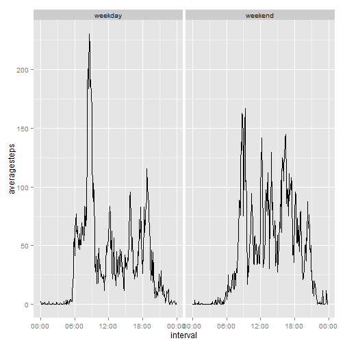

## Loading and preprocessing the data

```r
data<-read.csv(unz("activity.zip","activity.csv"),stringsAsFactors=FALSE)
#data<-read.csv(unz("activity.zip","activity.csv"))
data$interval<-as.character(data$interval)


data$interval<-sapply(X=data$interval,function(time)
  
{
  
  if (nchar(time)==1)
    paste("00",":0",time,sep="")
  else if (nchar(time)==2)
    paste("00:",time,sep="")
  else if (nchar(time)==3)
    paste("0",substr(time,1,1),":",substr(time,2,3),sep="")
  else if(nchar(time)==4)
    paste(substr(time,1,2),":",substr(time,3,4),sep="")
  
  
}
)


library(lubridate)

data$newdate<-paste(data$date,data$interval,sep=" ")

#data$newdate<-as.Date(strptime(data$newdate,format="%Y-%m-%d %H:%M"))

processeddata<-data[complete.cases(data),]
```
## What is mean total number of steps taken per day?

```r
avgsteps<-tapply(processeddata$steps,processeddata$date,FUN=sum)
print(avgsteps)
```

```
## 2012-10-02 2012-10-03 2012-10-04 2012-10-05 2012-10-06 2012-10-07 
##        126      11352      12116      13294      15420      11015 
## 2012-10-09 2012-10-10 2012-10-11 2012-10-12 2012-10-13 2012-10-14 
##      12811       9900      10304      17382      12426      15098 
## 2012-10-15 2012-10-16 2012-10-17 2012-10-18 2012-10-19 2012-10-20 
##      10139      15084      13452      10056      11829      10395 
## 2012-10-21 2012-10-22 2012-10-23 2012-10-24 2012-10-25 2012-10-26 
##       8821      13460       8918       8355       2492       6778 
## 2012-10-27 2012-10-28 2012-10-29 2012-10-30 2012-10-31 2012-11-02 
##      10119      11458       5018       9819      15414      10600 
## 2012-11-03 2012-11-05 2012-11-06 2012-11-07 2012-11-08 2012-11-11 
##      10571      10439       8334      12883       3219      12608 
## 2012-11-12 2012-11-13 2012-11-15 2012-11-16 2012-11-17 2012-11-18 
##      10765       7336         41       5441      14339      15110 
## 2012-11-19 2012-11-20 2012-11-21 2012-11-22 2012-11-23 2012-11-24 
##       8841       4472      12787      20427      21194      14478 
## 2012-11-25 2012-11-26 2012-11-27 2012-11-28 2012-11-29 
##      11834      11162      13646      10183       7047
```

## histogram of the total number of steps taken each day

```r
hist(avgsteps)
```

 

## Calculate and report the mean and median of the total number of steps taken per day

```r
meanavgsteps<-tapply(processeddata$steps,processeddata$date,FUN=mean)
print(meanavgsteps)
```

```
## 2012-10-02 2012-10-03 2012-10-04 2012-10-05 2012-10-06 2012-10-07 
##  0.4375000 39.4166667 42.0694444 46.1597222 53.5416667 38.2465278 
## 2012-10-09 2012-10-10 2012-10-11 2012-10-12 2012-10-13 2012-10-14 
## 44.4826389 34.3750000 35.7777778 60.3541667 43.1458333 52.4236111 
## 2012-10-15 2012-10-16 2012-10-17 2012-10-18 2012-10-19 2012-10-20 
## 35.2048611 52.3750000 46.7083333 34.9166667 41.0729167 36.0937500 
## 2012-10-21 2012-10-22 2012-10-23 2012-10-24 2012-10-25 2012-10-26 
## 30.6284722 46.7361111 30.9652778 29.0104167  8.6527778 23.5347222 
## 2012-10-27 2012-10-28 2012-10-29 2012-10-30 2012-10-31 2012-11-02 
## 35.1354167 39.7847222 17.4236111 34.0937500 53.5208333 36.8055556 
## 2012-11-03 2012-11-05 2012-11-06 2012-11-07 2012-11-08 2012-11-11 
## 36.7048611 36.2465278 28.9375000 44.7326389 11.1770833 43.7777778 
## 2012-11-12 2012-11-13 2012-11-15 2012-11-16 2012-11-17 2012-11-18 
## 37.3784722 25.4722222  0.1423611 18.8923611 49.7881944 52.4652778 
## 2012-11-19 2012-11-20 2012-11-21 2012-11-22 2012-11-23 2012-11-24 
## 30.6979167 15.5277778 44.3993056 70.9270833 73.5902778 50.2708333 
## 2012-11-25 2012-11-26 2012-11-27 2012-11-28 2012-11-29 
## 41.0902778 38.7569444 47.3819444 35.3576389 24.4687500
```

```r
medianavgsteps<-tapply(processeddata$steps,processeddata$date,FUN=median)
print(medianavgsteps)
```

```
## 2012-10-02 2012-10-03 2012-10-04 2012-10-05 2012-10-06 2012-10-07 
##          0          0          0          0          0          0 
## 2012-10-09 2012-10-10 2012-10-11 2012-10-12 2012-10-13 2012-10-14 
##          0          0          0          0          0          0 
## 2012-10-15 2012-10-16 2012-10-17 2012-10-18 2012-10-19 2012-10-20 
##          0          0          0          0          0          0 
## 2012-10-21 2012-10-22 2012-10-23 2012-10-24 2012-10-25 2012-10-26 
##          0          0          0          0          0          0 
## 2012-10-27 2012-10-28 2012-10-29 2012-10-30 2012-10-31 2012-11-02 
##          0          0          0          0          0          0 
## 2012-11-03 2012-11-05 2012-11-06 2012-11-07 2012-11-08 2012-11-11 
##          0          0          0          0          0          0 
## 2012-11-12 2012-11-13 2012-11-15 2012-11-16 2012-11-17 2012-11-18 
##          0          0          0          0          0          0 
## 2012-11-19 2012-11-20 2012-11-21 2012-11-22 2012-11-23 2012-11-24 
##          0          0          0          0          0          0 
## 2012-11-25 2012-11-26 2012-11-27 2012-11-28 2012-11-29 
##          0          0          0          0          0
```


## What is the average daily activity pattern?

```r
avgsteps1<-tapply(processeddata$steps,processeddata$interval,FUN=mean)
library(ggplot2)

dfavgsteps<-data.frame(levels(factor(processeddata$interval)),avgsteps1)
colnames(dfavgsteps)<-c("interval","steps")
test$interval<-strptime(dfavgsteps$interval,format="%H:%M")
```

```
## Error in test$interval <- strptime(dfavgsteps$interval, format = "%H:%M"): object 'test' not found
```

```r
library(scales)
p<-ggplot(dfavgsteps,aes(x=interval,y=steps,group=1))+geom_line()+scale_x_datetime(labels = date_format("%H:%M"))

print(p)
```

```
## Error: Invalid input: time_trans works with objects of class POSIXct only
```
## Imputing missing values

## Calculate and report the total number of missing values in the dataset (i.e. the total number of rows with NAs)

```r
print(nrow(data)-nrow(processeddata))
```

```
## [1] 2304
```

## filling in all of the missing values in the dataset using the mean for that particular interval

```r
newdata<-data

for(i  in 1:nrow(data))
{
  
  if (is.na(data$steps[i])) {newdata$steps[i]<-mean(data$steps[data$interval==data$interval[i]],na.rm=TRUE)}
}
    
summary(newdata)
```

```
##      steps            date             interval           newdate         
##  Min.   :  0.00   Length:17568       Length:17568       Length:17568      
##  1st Qu.:  0.00   Class :character   Class :character   Class :character  
##  Median :  0.00   Mode  :character   Mode  :character   Mode  :character  
##  Mean   : 37.38                                                           
##  3rd Qu.: 27.00                                                           
##  Max.   :806.00
```
## histogram of the total number of steps taken each day and Calculate and report the mean and median total number of steps taken per day

```r
avgsteps<-tapply(newdata$steps,newdata$date,FUN=sum)
print(avgsteps)
```

```
## 2012-10-01 2012-10-02 2012-10-03 2012-10-04 2012-10-05 2012-10-06 
##   10766.19     126.00   11352.00   12116.00   13294.00   15420.00 
## 2012-10-07 2012-10-08 2012-10-09 2012-10-10 2012-10-11 2012-10-12 
##   11015.00   10766.19   12811.00    9900.00   10304.00   17382.00 
## 2012-10-13 2012-10-14 2012-10-15 2012-10-16 2012-10-17 2012-10-18 
##   12426.00   15098.00   10139.00   15084.00   13452.00   10056.00 
## 2012-10-19 2012-10-20 2012-10-21 2012-10-22 2012-10-23 2012-10-24 
##   11829.00   10395.00    8821.00   13460.00    8918.00    8355.00 
## 2012-10-25 2012-10-26 2012-10-27 2012-10-28 2012-10-29 2012-10-30 
##    2492.00    6778.00   10119.00   11458.00    5018.00    9819.00 
## 2012-10-31 2012-11-01 2012-11-02 2012-11-03 2012-11-04 2012-11-05 
##   15414.00   10766.19   10600.00   10571.00   10766.19   10439.00 
## 2012-11-06 2012-11-07 2012-11-08 2012-11-09 2012-11-10 2012-11-11 
##    8334.00   12883.00    3219.00   10766.19   10766.19   12608.00 
## 2012-11-12 2012-11-13 2012-11-14 2012-11-15 2012-11-16 2012-11-17 
##   10765.00    7336.00   10766.19      41.00    5441.00   14339.00 
## 2012-11-18 2012-11-19 2012-11-20 2012-11-21 2012-11-22 2012-11-23 
##   15110.00    8841.00    4472.00   12787.00   20427.00   21194.00 
## 2012-11-24 2012-11-25 2012-11-26 2012-11-27 2012-11-28 2012-11-29 
##   14478.00   11834.00   11162.00   13646.00   10183.00    7047.00 
## 2012-11-30 
##   10766.19
```

```r
hist(avgsteps)
```

 

```r
meanavgsteps<-tapply(newdata$steps,newdata$date,FUN=mean)
print(meanavgsteps)
```

```
## 2012-10-01 2012-10-02 2012-10-03 2012-10-04 2012-10-05 2012-10-06 
## 37.3825996  0.4375000 39.4166667 42.0694444 46.1597222 53.5416667 
## 2012-10-07 2012-10-08 2012-10-09 2012-10-10 2012-10-11 2012-10-12 
## 38.2465278 37.3825996 44.4826389 34.3750000 35.7777778 60.3541667 
## 2012-10-13 2012-10-14 2012-10-15 2012-10-16 2012-10-17 2012-10-18 
## 43.1458333 52.4236111 35.2048611 52.3750000 46.7083333 34.9166667 
## 2012-10-19 2012-10-20 2012-10-21 2012-10-22 2012-10-23 2012-10-24 
## 41.0729167 36.0937500 30.6284722 46.7361111 30.9652778 29.0104167 
## 2012-10-25 2012-10-26 2012-10-27 2012-10-28 2012-10-29 2012-10-30 
##  8.6527778 23.5347222 35.1354167 39.7847222 17.4236111 34.0937500 
## 2012-10-31 2012-11-01 2012-11-02 2012-11-03 2012-11-04 2012-11-05 
## 53.5208333 37.3825996 36.8055556 36.7048611 37.3825996 36.2465278 
## 2012-11-06 2012-11-07 2012-11-08 2012-11-09 2012-11-10 2012-11-11 
## 28.9375000 44.7326389 11.1770833 37.3825996 37.3825996 43.7777778 
## 2012-11-12 2012-11-13 2012-11-14 2012-11-15 2012-11-16 2012-11-17 
## 37.3784722 25.4722222 37.3825996  0.1423611 18.8923611 49.7881944 
## 2012-11-18 2012-11-19 2012-11-20 2012-11-21 2012-11-22 2012-11-23 
## 52.4652778 30.6979167 15.5277778 44.3993056 70.9270833 73.5902778 
## 2012-11-24 2012-11-25 2012-11-26 2012-11-27 2012-11-28 2012-11-29 
## 50.2708333 41.0902778 38.7569444 47.3819444 35.3576389 24.4687500 
## 2012-11-30 
## 37.3825996
```

```r
medianavgsteps<-tapply(newdata$steps,newdata$date,FUN=median)
print(medianavgsteps)
```

```
## 2012-10-01 2012-10-02 2012-10-03 2012-10-04 2012-10-05 2012-10-06 
##   34.11321    0.00000    0.00000    0.00000    0.00000    0.00000 
## 2012-10-07 2012-10-08 2012-10-09 2012-10-10 2012-10-11 2012-10-12 
##    0.00000   34.11321    0.00000    0.00000    0.00000    0.00000 
## 2012-10-13 2012-10-14 2012-10-15 2012-10-16 2012-10-17 2012-10-18 
##    0.00000    0.00000    0.00000    0.00000    0.00000    0.00000 
## 2012-10-19 2012-10-20 2012-10-21 2012-10-22 2012-10-23 2012-10-24 
##    0.00000    0.00000    0.00000    0.00000    0.00000    0.00000 
## 2012-10-25 2012-10-26 2012-10-27 2012-10-28 2012-10-29 2012-10-30 
##    0.00000    0.00000    0.00000    0.00000    0.00000    0.00000 
## 2012-10-31 2012-11-01 2012-11-02 2012-11-03 2012-11-04 2012-11-05 
##    0.00000   34.11321    0.00000    0.00000   34.11321    0.00000 
## 2012-11-06 2012-11-07 2012-11-08 2012-11-09 2012-11-10 2012-11-11 
##    0.00000    0.00000    0.00000   34.11321   34.11321    0.00000 
## 2012-11-12 2012-11-13 2012-11-14 2012-11-15 2012-11-16 2012-11-17 
##    0.00000    0.00000   34.11321    0.00000    0.00000    0.00000 
## 2012-11-18 2012-11-19 2012-11-20 2012-11-21 2012-11-22 2012-11-23 
##    0.00000    0.00000    0.00000    0.00000    0.00000    0.00000 
## 2012-11-24 2012-11-25 2012-11-26 2012-11-27 2012-11-28 2012-11-29 
##    0.00000    0.00000    0.00000    0.00000    0.00000    0.00000 
## 2012-11-30 
##   34.11321
```

## Are there differences in activity patterns between weekdays and weekends?

```r
newdata$isweekend=sapply(as.Date(newdata$date),function(x){
  if(weekdays(x)=="Sunday" || weekdays(x)=="Saturday")
    "weekend"
  else
    "weekday"  
})
levels(newdata$isweekend)<-factor(newdata$isweekend)
```

```
## Warning in `levels<-`(`*tmp*`, value = structure(c("weekday", "weekday", :
## duplicated levels in factors are deprecated
```

```r
newdata$interval<-strptime(newdata$interval,format="%H:%M")
library(plyr)
```

```
## 
## Attaching package: 'plyr'
## 
## The following object is masked from 'package:lubridate':
## 
##     here
```

```r
mm <- ddply(newdata, c("isweekend","interval"), summarise, mmpg = mean(steps))
newplot<-ggplot(mm, aes(x = interval,y=mmpg)) +geom_line()+scale_x_datetime(labels = date_format("%H:%M"))+facet_grid(.~isweekend)
print(newplot)
```

 
